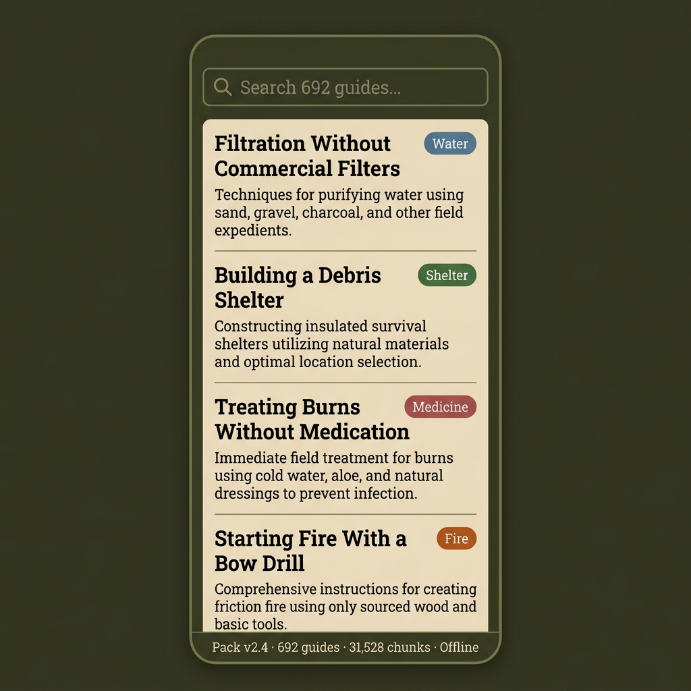
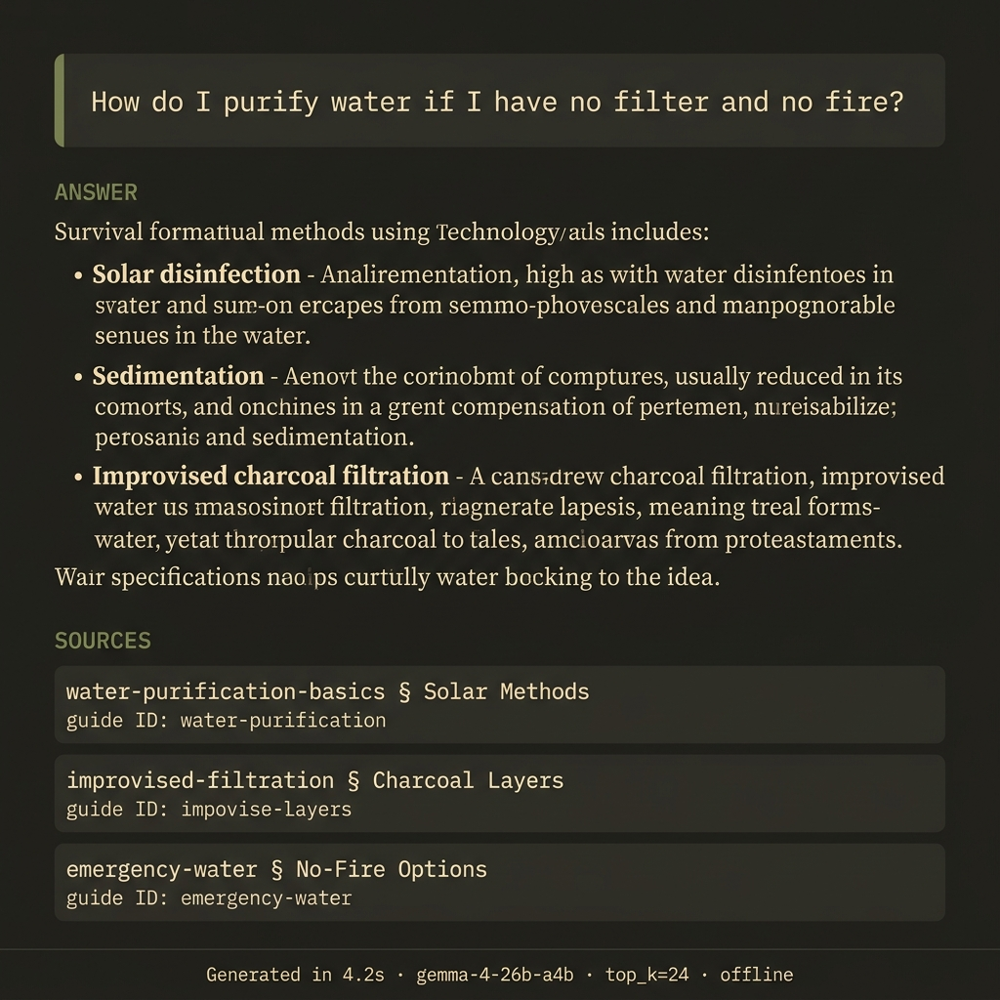
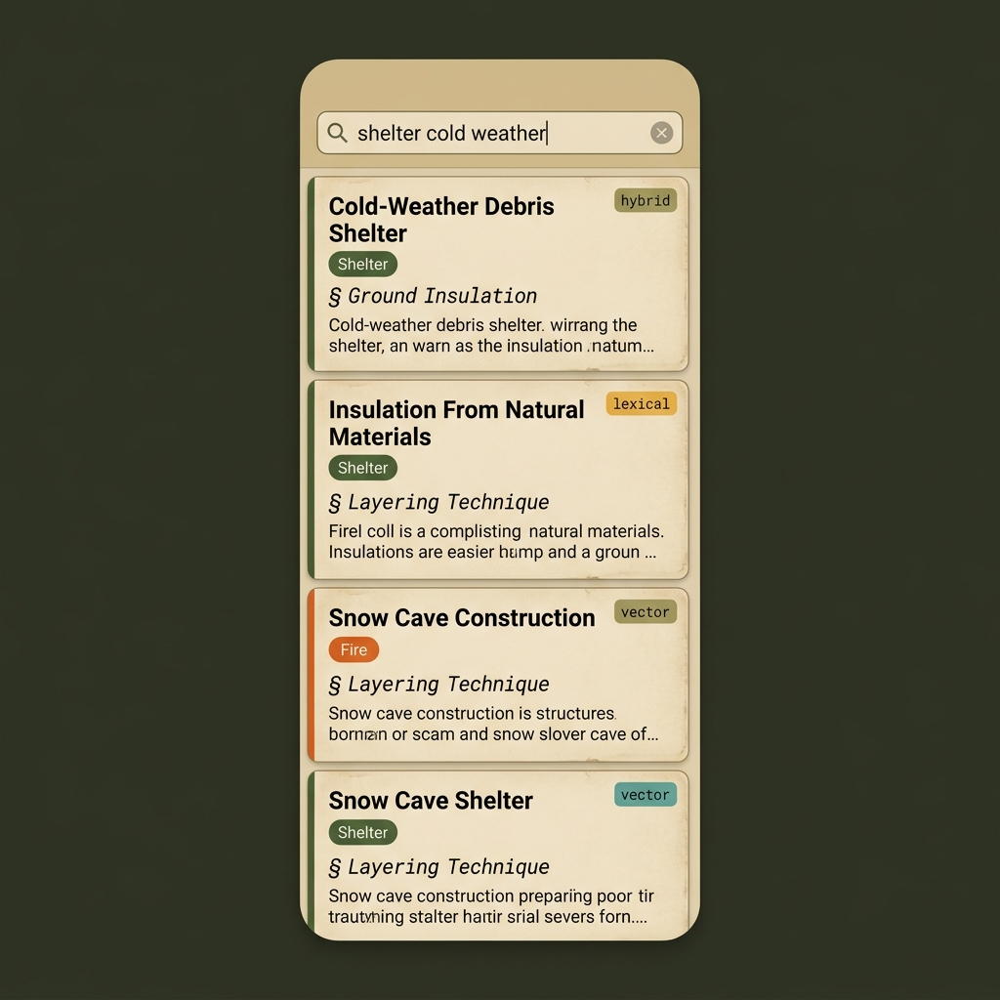
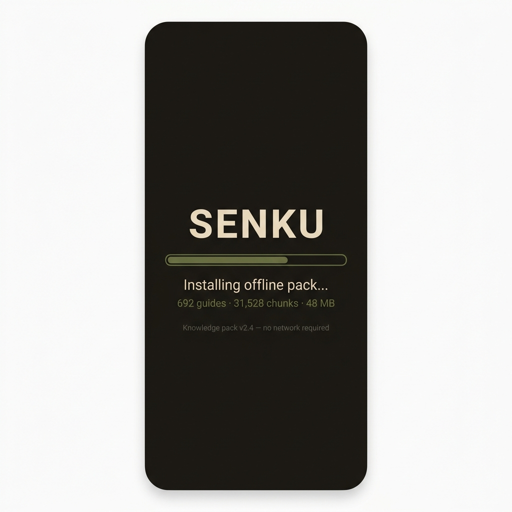

# Senku Mobile Historical UI Mockups

> [!WARNING]
> Historical concept/mockup material only. This does not represent current product truth, and the counts, copy, and citations shown here are synthetic or stale. Relocated from the repo root during D16 so the bundle can live at repo-stable paths.

Four screens covering the core interaction loop: browse -> search -> read answer -> first-launch onboarding.

---

## 1. Home Screen / Guide Browser

**Key elements:** search bar ("Search 692 guides..."), scrollable guide cards with category badge pills (Water / Fire / Medicine / Shelter), pack version + guide count status bar at bottom. Dark olive background, parchment card surfaces.

---

## 2. Offline Answer Detail View

**Key elements:** question block with olive left-border accent, ANSWER section with structured body text, SOURCES section listing 3 guide citations with `Section` headings, footer with generation time / model / top_k / offline badge. Dark warm background, military-logbook typography.

---

## 3. Search Results with Retrieval Mode Badges

**Key elements:** active query in search bar, result cards with category tag pills, `Section` headings, 2-line excerpts, and per-card retrieval-mode badge (hybrid / lexical / vector). Warm tan + forest green palette, field-notebook texture.

---

## 4. First Launch / Pack Install Splash

**Key elements:** centered "SENKU" title, thin olive-green progress bar (~60%), "Installing offline pack..." status, "692 guides - 31,528 chunks - 48 MB" stats, "no network required" footer. Near-black background, single accent color - embedded-system boot aesthetic.

---

## Design System Notes

| Token | Value | Usage |
|-------|-------|-------|
| `bg-primary` | `#1e1d1a` | Splash / deepest background |
| `bg-surface` | `#2b2a25` | Answer detail background |
| `bg-olive` | `#3a3f2b` | Home screen background |
| `surface-card` | `#e8dcc8` | Card / parchment surfaces |
| `text-primary` | `#e8dcc8` | Body text on dark bgs |
| `accent-olive` | `#6b7a4a` | Progress bar, section headers |
| `badge-water` | steel blue | Category: Water |
| `badge-fire` | burnt orange | Category: Fire |
| `badge-medicine` | muted red | Category: Medicine |
| `badge-shelter` | forest green | Category: Shelter |
| `retrieval-hybrid` | olive | Hybrid retrieval badge |
| `retrieval-lexical` | amber | Lexical retrieval badge |
| `retrieval-vector` | teal | Vector retrieval badge |

> [!TIP]
> These mockups are static references. If you want to proceed to a buildable HTML/CSS prototype for any of these screens, let me know which one to start with.
